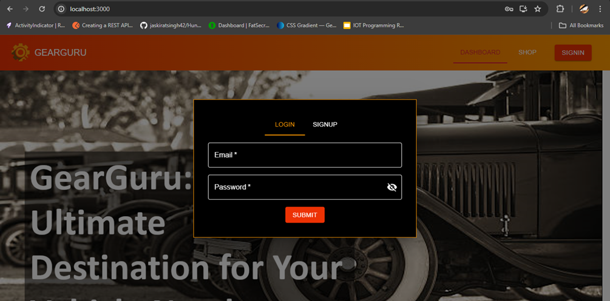
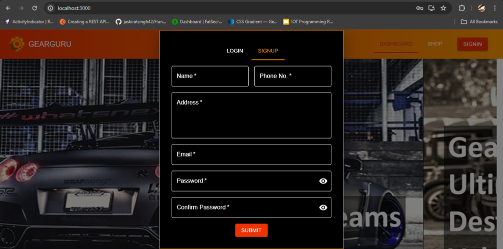
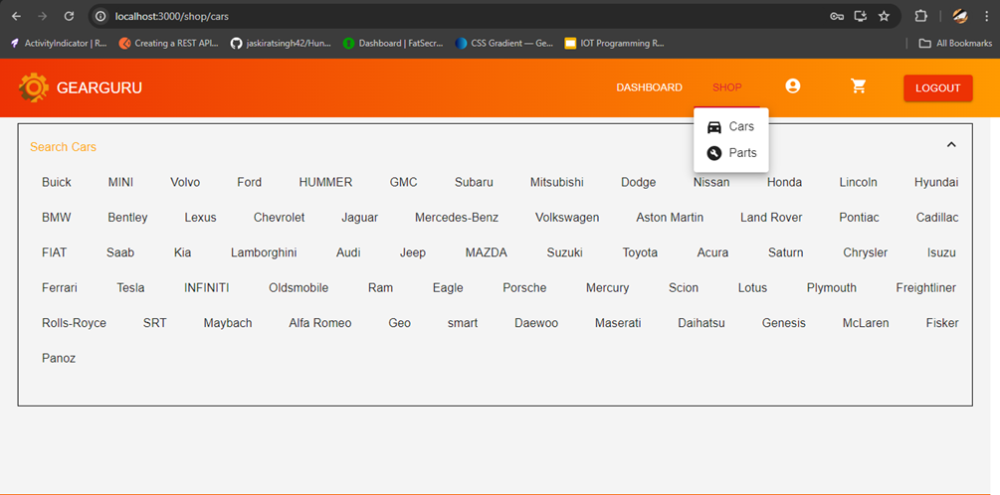
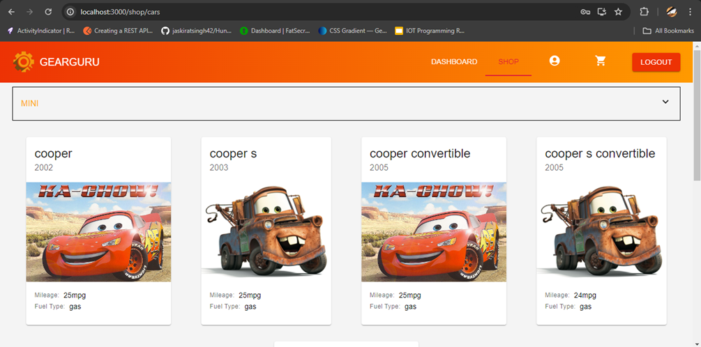
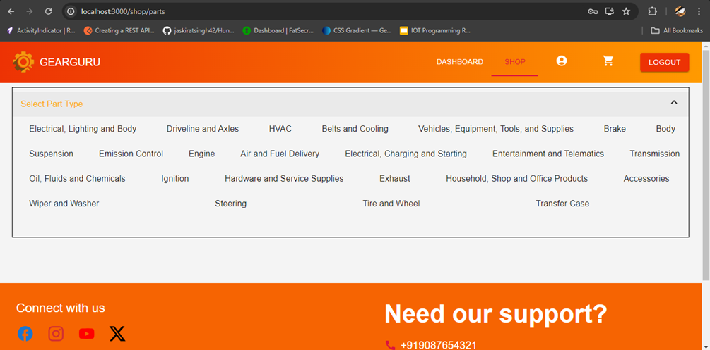
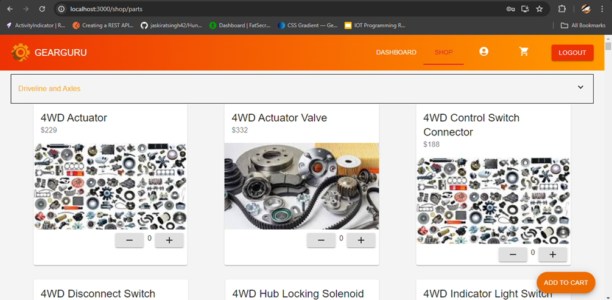
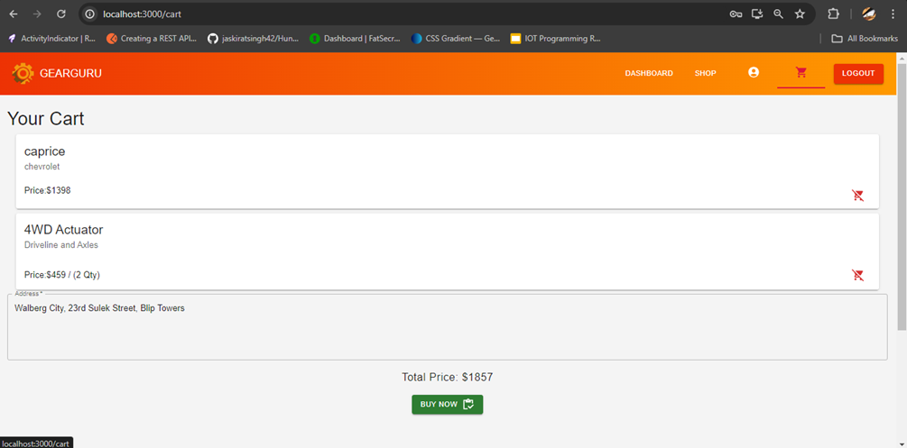
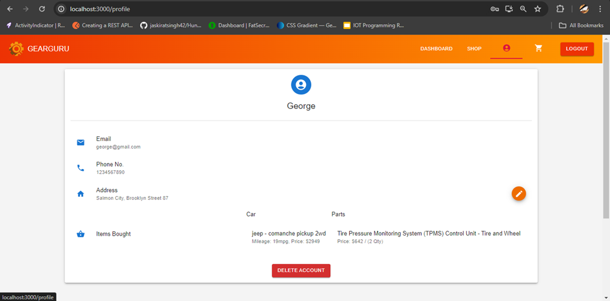

# GearGuru

## Description

GearGuru is a MERN stack-based application designed to imitate an E-Commerce application to purchase cars and car parts. This project includes a frontend and a backend, built using React, Node.js, Express, and MongoDB.

## Technologies Used

- **Frontend**: React, React Router, Redux, Material UI.
- **Backend**: Node.js, Express.
- **Database**: MongoDB
- **APIs**: rapidapi.com

## Project Structure

```
GearGuru/
│
├── frontend/
│   └── [Frontend files like components, styles, etc.]
├── backend/
│   └── [Backend files like routes, models, controllers, etc.]
├── .gitignore
└── README.md
```

## Snapshots










